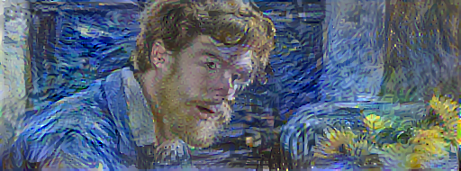
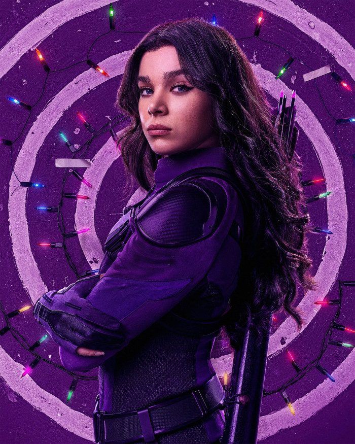
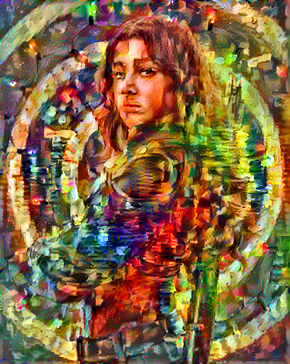
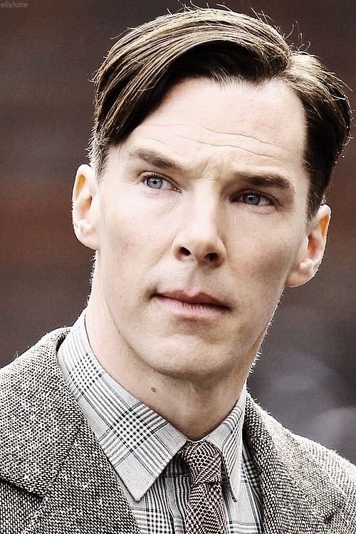
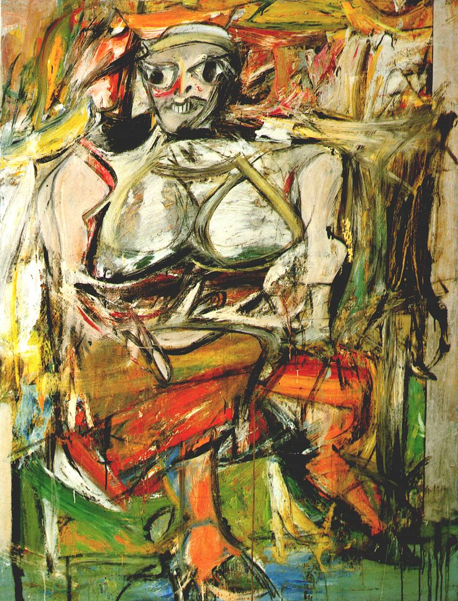
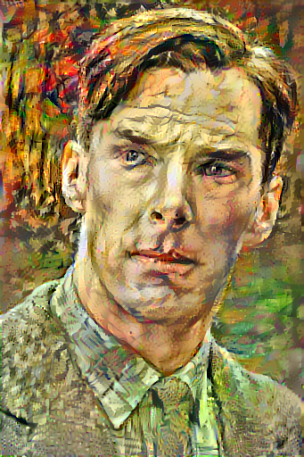

# Neural-style-transfer
An implementation of the neural style in Tensorflow! This notebook implements [Neural Style Transfer Using Convolutional Neural Networks](https://www.tensorflow.org/tutorials/generative/style_transfer) by Tensorflow. This tutorial demonstrates the original style-transfer algorithm. It optimizes the image content to a particular style. Modern approaches train a model to generate the stylized image directly (similar to [cyclegan](https://www.tensorflow.org/tutorials/generative/cyclegan)). This approach is much faster (up to 1000x).
## Examples: Style Transfer
---
### Benedict Cumberbatch on Van Gogh: Painted with Words film and Starry Night by Vincent van Gogh
Bendict Cumberbatch | Starry Night | Stylized image
--- | --- | ---
 |  | 

### Kate Bishop on Hawkeye TV Mini Series and Oil Painting of a Girl in Rain
Kate Bishop | Oil Painting of a Girl in Rain | Stylized image
--- | --- | ---
 |  | 

### Benedict Cumberbatch as Alan Turing on Imitation Game film and Woman I by Willem de Kooning
Benedict Cumberbatch | Woman I by Willem de Kooning | Stylized image
--- | --- | ---
 |  | 
